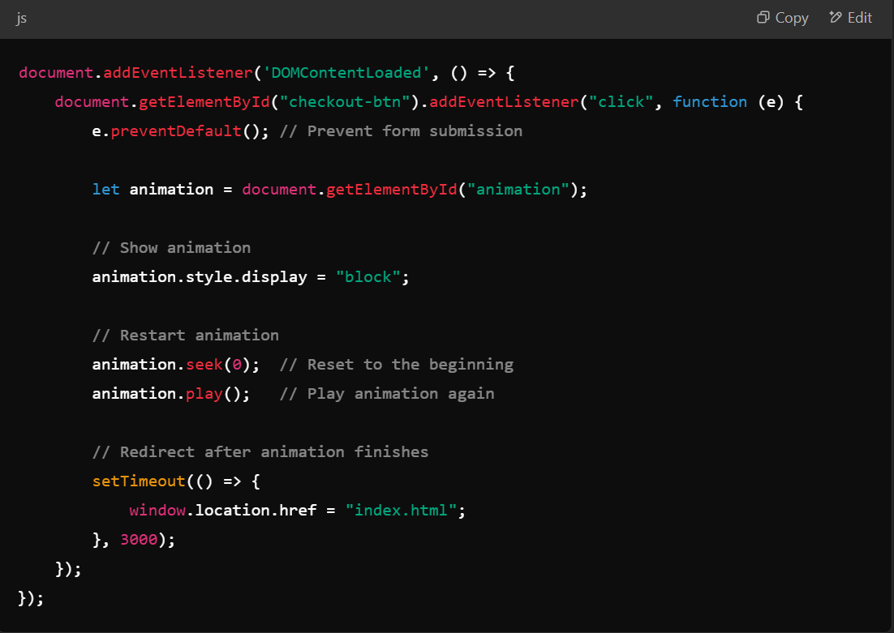
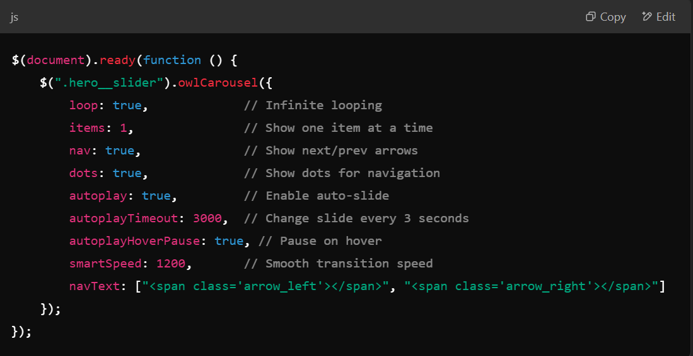

# MokeSell Online Platform
MokeSell is an online marketplace that enables users to buy and sell new and second-hand goods. Inspired by popular eCommerce platforms such as Depop and Carousell, MokeSell offers a seamless browsing experience, allowing users to search, list, and purchase items efficiently. Additionally, the platform incorporates gamification elements, enhancing user engagement and interaction.

## Design Process
The development of MokeSell was driven by extensive research on existing eCommerce platforms. The primary objectives included:
- Providing a user-friendly interface for both buyers and sellers.
- Implementing seamless navigation and product discovery features.
- Ensuring secure transactions and an engaging shopping experience.
- Introducing a gamified experience through an interactive game inspired by "2048."

## Features
MokeSell consists of several core features across multiple pages:

### **1. Index Page**
- Serves as the main home page.
- Users can browse items, list products for sale, view their cart, and log in/sign up.
- Includes a game for users to earn points.

### **2. Shop Page**
- Displays all product listings with filters and search options.

### **3. Shop Details Page**
- Displays detailed information about a selected product.
- Users can add the item to their cart or chat with the seller.

### **4. Shopping Cart**
- Allows users to view items they have added to their cart.
- Users can update or remove items before proceeding to checkout.

### **5. Seller Profile Page**
- Showcases a seller’s profile along with their active listings.
- Buyers can view and interact with sellers.

### **6. Buyer Profile Page**
- Displays user details, purchase history, and saved items.

### **7. Log In & 8. Sign In Pages**
- Users can create an account or log into an existing one.
- Offers third-party authentication (e.g., Google and Apple login options).

### **9. Create Listing Page**
- Sellers can upload new product listings with images, descriptions, and pricing.

### **10. Contact Page**
- Provides users with support and customer service information.

### **11. Bump Page**
- Allows sellers to boost their listings using three different types of bumps.

### **12. Chat Page**
- Enables buyers and sellers to communicate directly regarding products.

### **13. Checkout Page**
- Users can finalize their purchases securely.

### **14. Game Page**
- An interactive game inspired by "2048" where users can earn points.

### **15. About Us Page**
- Provides background information about MokeSell and its mission.

## Technologies Used
The MokeSell platform was built using a combination of modern web development technologies, including:

- **HTML**: Structuring the website layout.
- **CSS (Bootstrap, FontAwesome, Custom Styles)**: Styling and responsiveness.
- **JavaScript**: Enhancing interactivity and user experience.
- **RestDB** API Implementation and database management.
- **Game Development**: JavaScript logic for the "2048" game.

## Assistive AI
Throughout the development process, AI-assisted solutions were used to troubleshoot and optimize the project. Key interactions included:

### **Asked how to start the animation**

### **Asked how to make the carousel autoplay**

## Testing
The platform was rigorously tested to ensure:
- **User authentication**: Secure login and registration processes.
- **Shopping cart functionality**: Adding, removing, and updating cart items.
- **Checkout process**: Smooth and secure transactions.
- **Mobile responsiveness**: Proper display and navigation on all screen sizes.
- **Game integration**: The "2048" game mechanics work correctly.
- **Chat system**: Users can communicate seamlessly.

## Credits
- **Base JavaScript code for the "2048" game**: Sourced online (Original site unknown).
- **Icons and UI components**: Bootstrap & FontAwesome.
- **General inspiration**: Derived from existing eCommerce platforms like Depop and Carousell.

---
